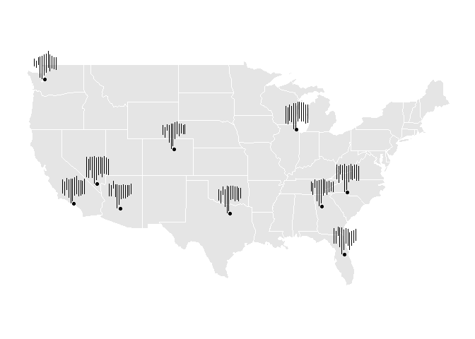

<!-- README.md is generated from README.Rmd. Please edit that file -->

# stglpyhs

<!-- badges: start -->

[](https://github.com/Knicey/stglyphs/actions/workflows/R-CMD-check.yaml)
[](https://app.codecov.io/gh/Knicey/stglyphs?branch=master)

<!-- badges: end -->

The goal of stglpyhs is to introduce new ways of visualizing
spatio-temporal data and in particular analyzing across multivariate
seasonal data. The existing cubble package implements glyph maps in the
form of line graphs. This project seeks to expand this functionality to
segment plots to visualize multivariable data better and analyze
seasonal trends.

## Installation

You can install the development version of stglpyhs from
[GitHub](https://github.com/) with:

``` r
# install.packages("devtools")
devtools::install_github("Knicey/stglyphs")
```

## Example

This is an example which displays seasonal mins and maxes in temperature
from NOAA across the US:

``` r
library(stglpyhs)
library(dplyr)
#> 
#> Attaching package: 'dplyr'
#> The following objects are masked from 'package:stats':
#> 
#>     filter, lag
#> The following objects are masked from 'package:base':
#> 
#>     intersect, setdiff, setequal, union
library(ggplot2)
library(lubridate)
#> 
#> Attaching package: 'lubridate'
#> The following objects are masked from 'package:base':
#> 
#>     date, intersect, setdiff, union

stations_grouped <- stations |>
  group_by(month, name, long, lat) |>
  summarise(
    avgmin = mean(tmin, na.rm = TRUE),
    avgmax = mean(tmax, na.rm = TRUE)
  ) |>
  ungroup() 
#> `summarise()` has grouped output by 'month', 'name', 'long'. You can override
#> using the `.groups` argument.
#TODO: Accommodate for xend aesthetic (required in geom_segment)
```

``` r
ggplot(data = stations_grouped) +
  geom_sf(data = mainland_us, color = "white") +
  ggthemes::theme_map() +
  geom_point(aes(x = long, y = lat)) +
  geom_segment_glyph(
    x_scale = rescale11x,
    y_scale = rescale11y,
    global_rescale = FALSE,
    width = 2,
    height = 3,
    aes(
    x_major = long, 
    y_major = lat, 
    x_minor = month, 
    y_minor = avgmin, 
    yend_minor = avgmax)
    ) 
#> Warning: Unknown or uninitialised column: `linewidth`.
#> Warning: Unknown or uninitialised column: `size`.
```


This is another example that shows flight cancellations from the
airports that have the most flight cancellations:

``` r
flights_grouped <- flights |>
  mutate(
    month = month(FL_DATE),
    year = year(FL_DATE)
  ) |>
  group_by(ORIGIN, month, year, longitude, latitude) |>
  summarise(
    total_flights = n()
  ) |>
  group_by(ORIGIN, month, longitude, latitude) |>
  summarise(
    max = max(total_flights),
    min = min(total_flights),
  )
#> `summarise()` has grouped output by 'ORIGIN', 'month', 'year', 'longitude'. You
#> can override using the `.groups` argument.
#> `summarise()` has grouped output by 'ORIGIN', 'month', 'longitude'. You can
#> override using the `.groups` argument.
```

``` r
ggplot(data = flights_grouped) +
  geom_sf(data = mainland_us, color = "white") +
  ggthemes::theme_map() +
  geom_point(aes(x = longitude, y = latitude)) +
  geom_segment_glyph(
    x_scale = rescale11x,
    y_scale = rescale01y,
    global_rescale = FALSE,
    width = 1.5,
    height = 3,
    aes(
    x_major = longitude, 
    y_major = latitude, 
    x_minor = month, 
    y_minor = min, 
    yend_minor = max)
    ) 
#> Warning: Unknown or uninitialised column: `linewidth`.
#> Warning: Unknown or uninitialised column: `size`.
```


